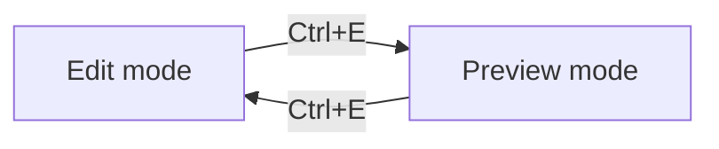

# Markdown Test Document

This file exercises every markdown feature the editor should render. Use it as a visual regression check — if something looks off, open an issue.

## Headings

# H1 — The largest heading
## H2 — Section heading
### H3 — Subsection
#### H4 — Minor heading
##### H5 — Rarely used
###### H6 — Almost never used

## Emphasis

This is a plain paragraph with *italic text*, **bold text**, and ***bold italic text*** embedded. You can also ~~strike things out~~ when writing notes.

Inline `code spans` should stand out with a subtle background tint — but not too loud. Try a longer one: `const editor = new EditorView({ state, parent })`.

## Paragraphs and line length

A paragraph of real-sounding prose so you can see how the text breathes at the locked column width. Monospace fonts with generous line-height and a 70-character cap make long reading surprisingly comfortable — you can scan from left to right without your eyes hunting for the next line. The whole point of this exercise is to feel whether the editor is a place you would actually want to write in, or a place you would grudgingly open to fix a typo.

A second paragraph, because rhythm matters. Two paragraphs in a row should have space between them that feels intentional, not accidental.

## Lists

### Unordered

- First item
- Second item with some longer text that might wrap to a second line depending on the window width, which is a useful thing to test
- Third item
  - Nested item
  - Another nested item
    - Deeply nested
- Back to top level

### Ordered

1. Do the thing
2. Do the next thing
3. Do the third thing
   1. Nested step
   2. Another nested step
4. Finish

### Task list (GFM)

- [x] Set up Tauri scaffold
- [x] Bundle Hasklig
- [x] Muted markdown syntax
- [ ] Preview mode
- [ ] Export to HTML and PDF
- [ ] Packaging as AppImage

## Blockquotes

> A short quote on a single line.

> A longer quote that spans multiple lines and wraps naturally at the column edge, demonstrating that the quote styling holds up for substantial passages rather than only one-liners.

> Nested quotes:
>
> > Inner quote, one level deep.
> >
> > > And deeper still.

## Code

Inline `code` looks like `this`.

A fenced block without a language:

```
plain fenced content
no syntax highlighting
```

A fenced block with a language hint (TypeScript):

```typescript
import { EditorView } from "@codemirror/view";

export function createEditor(parent: HTMLElement, initial: string) {
  const state = EditorState.create({ doc: initial });
  return new EditorView({ state, parent });
}
```

A Rust block:

```rust
#[tauri::command]
fn read_file(path: String) -> Result<String, String> {
    std::fs::read_to_string(&path).map_err(|e| e.to_string())
}
```

A shell block:

```bash
pnpm tauri dev -- test.md
```

## Links and images

Inline link: [Tauri documentation](https://tauri.app).

Autolink: <https://github.com/i-tu/Hasklig>.

Reference-style link: see [the CodeMirror docs][cm6] for editor internals.

[cm6]: https://codemirror.net/docs/

Image (renders in preview only):


## Tables (GFM)

| Feature         | Status | Notes                          |
|-----------------|:------:|--------------------------------|
| Edit mode       |   ✓    | CodeMirror 6                   |
| Muted syntax    |   ✓    | Via decorations                |
| Preview mode    |   ·    | M2                             |
| Math (KaTeX)    |   ·    | M3                             |
| Mermaid         |   ·    | M3                             |
| HTML/PDF export |   ·    | M4                             |

| Left-aligned | Centered | Right-aligned |
|:-------------|:--------:|--------------:|
| a            |    b     |             c |
| longer row   |   mid    |           end |

## Horizontal rules

Three hyphens:

---

Asterisks work too:

***

## Math (source-only in edit mode; renders in preview at M3)

Inline math: $e^{i\pi} + 1 = 0$.

Display math:

$$
\int_{-\infty}^{\infty} e^{-x^2}\,dx = \sqrt{\pi}
$$

## Mermaid (source-only in edit mode; renders in preview at M3)



## Raw HTML

<div style="padding: 8px; border: 1px solid #ccc;">
  A raw HTML block — rendered in preview, shown as source in edit mode.
</div>

Inline HTML: this text has <kbd>Ctrl</kbd>+<kbd>S</kbd> keys.

## Escapes and edge cases

Literal asterisks: \*not italic\*. Literal backticks: \`not code\`.

An em-dash — like this. An ellipsis… like this. Smart quotes "like so" and 'like so'.

A line with trailing spaces, forcing a hard break,  
continues on the next line.

Emoji work too if the system font supports them: 📝 ✨ 🦀.

## End

If this document reads cleanly, the editor is in good shape.
